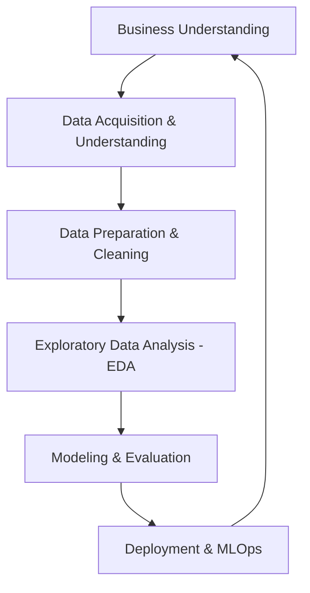

# Class 1: Introduction to Data Science, Machine Learning, and Artificial Intelligence

Welcome to the **Machine Learning & AI BootCamp**. In this introductory class, we will establish the foundational concepts of Data Science (DS), Artificial Intelligence (AI), Machine Learning (ML), and Deep Learning (DL). We will also map out the career opportunities, the tool stack we will use throughout the course, and essential math prerequisites (Linear Algebra and Statistics).

---

## 1. Data Science Overview
**Data Science** is an interdisciplinary field that uses scientific methods, processes, algorithms, and systems to extract knowledge and insights from structured and unstructured data. It combines domain expertise, programming skills, and knowledge of mathematics and statistics.

### The Lifecycle of a Data Science Project
A standard data science project goes through the following iterative phases (often described by the **CRISP-DM** methodology):



1. **Business Understanding**: Identifying the problem, defining goals, and understanding key metrics (e.g., reducing churn, predicting revenue).
2. **Data Acquisition & Extraction**: Gathering raw data from databases, APIs, web scraping, or files (CSV, JSON).
3. **Data Preparation & Cleaning**: Handling missing values, removing duplicates, parsing dates, correcting errors, and formatting. This typically consumes **70-80%** of a data scientist's time.
4. **Exploratory Data Analysis (EDA)**: Using statistics and visualizations (histograms, scatter plots, correlation matrices) to find patterns and anomalies.
5. **Modeling & Evaluation**: Selecting algorithms, training models, tuning hyperparameters, and evaluating performance using appropriate metrics.
6. **Deployment & MLOps**: Integrating the model into production (e.g., as an API, web application) and setting up monitoring to track performance over time.

---

## 2. Artificial Intelligence (AI) vs. Machine Learning (ML) vs. Deep Learning (DL)
It is common to hear these terms used interchangeably, but they represent nested subsets of technology:

```
┌────────────────────────────────────────────────────────┐
│ Artificial Intelligence (AI)                           │
│   ┌────────────────────────────────────────────────┐   │
│   │ Machine Learning (ML)                          │   │
│   │   ┌────────────────────────────────────────┐   │   │
│   │   │ Deep Learning (DL)                     │   │   │
│   │   │                                        │   │   │
│   │   └────────────────────────────────────────┘   │   │
│   └────────────────────────────────────────────────┘   │
└────────────────────────────────────────────────────────┘
```

| Criteria | Artificial Intelligence (AI) | Machine Learning (ML) | Deep Learning (DL) |
| :--- | :--- | :--- | :--- |
| **Definition** | Any technology that enables computers to mimic human intelligence (logic, rules, decision-making). | A subset of AI that uses statistical techniques to enable systems to "learn" and improve from data without being explicitly programmed. | A subset of ML based on Artificial Neural Networks (ANNs) with multiple layers (hence "deep") to learn representations of data. |
| **Approach** | Rule-based systems, expert systems, if-else logic, search algorithms, or learning algorithms. | Mathematical algorithms that map input features to output targets by optimizing a loss function. | Neural networks that automatically extract feature representations through hierarchical layers. |
| **Data Requirements** | Can work on zero data (e.g., rule-based chess engine using minimax search). | Works well on small to medium structured tabular datasets (thousands of rows). | Requires very large amounts of data (millions of samples) to avoid overfitting. |
| **Feature Engineering**| Manually programmed rules. | Crucial; human experts must select and transform relevant features. | Automatic; the network learns to extract features directly from raw data (e.g., raw pixels, raw text). |
| **Hardware** | Can run on standard CPUs. | Typically runs on standard CPUs; some models benefit from multi-core processing. | Highly dependent on specialized hardware like GPUs or TPUs for massive matrix operations. |
| **Examples** | Chess engine (Deep Blue), Pathfinding (A*), Expert medical rules. | Linear Regression, Decision Trees, Random Forests, Support Vector Machines (SVMs). | Convolutional Neural Networks (CNNs) for vision, Transformers (GPT-4, BERT) for NLP. |

---

## 3. Supervised vs. Unsupervised Learning
At a high level, machine learning models are categorized based on the presence and nature of the target variable during training:

```
                           ┌─────────────────────────┐
                           │    Machine Learning     │
                           └────────────┬────────────┘
                                        │
                 ┌──────────────────────┴──────────────────────┐
                 ▼                                             ▼
     ┌───────────────────────┐                     ┌───────────────────────┐
     │  Supervised Learning  │                     │ Unsupervised Learning │
     └───────────┬───────────┘                     └───────────┬───────────┘
                 │                                             │
         ┌───────┴───────┐                             ┌───────┴───────┐
         ▼               ▼                             ▼               ▼
   Regression     Classification                   Clustering    Dimension Red.
```

### Supervised Learning
In supervised learning, the model is trained on a **labeled dataset**. This means that for every input sample, the correct output (label/target) is provided.
- **Goal**: Learn a mapping function $f(x) = y$ to predict the output $y$ for new, unseen inputs $x$.
- **Examples**:
  - Predicting stock prices based on historical trends (Target: Numeric price).
  - Classifying emails as Spam or Not Spam (Target: Binary label).

### Unsupervised Learning
In unsupervised learning, the model is given **unlabeled data**. The algorithm must find hidden patterns, structures, or relationships within the data on its own.
- **Goal**: Group data points, find associations, or reduce the number of variables (dimensionality) without explicit labels.
- **Examples**:
  - Grouping customers into distinct segments based on buying behavior (Clustering).
  - Reducing 100 features of a dataset down to 2 principal components (Dimensionality Reduction).

---

## 4. Key Machine Learning Tasks: Regression, Classification, Clustering
Machine learning tasks are primarily divided into three categories based on the output and goals:

### A. Regression (Supervised)
* **What it is**: Predicting a continuous, real-valued numerical target.
* **Math representation**: Output $y \in \mathbb{R}$.
* **Real-world use cases**:
  - **Real Estate**: Predicting house prices based on square footage, location, and number of bedrooms.
  - **Finance**: Forecasting stock prices, revenue, or inflation rates.
  - **Meteorology**: Predicting tomorrow's temperature in degrees.
* **Common Algorithms**: Linear Regression, Support Vector Regression (SVR), Decision Tree Regressor, Random Forest Regressor.

### B. Classification (Supervised)
* **What it is**: Assigning data points to discrete categories or classes.
  - **Binary**: Exactly two classes (e.g., Yes/No, Spam/Not-Spam).
  - **Multi-class**: More than two classes (e.g., Cat, Dog, or Bird).
* **Math representation**: Output $y \in \{0, 1\}$ or $y \in \{C_1, C_2, \dots, C_k\}$.
* **Real-world use cases**:
  - **Healthcare**: Diagnosing whether a tumor is malignant or benign.
  - **Banking**: Detecting fraudulent credit card transactions.
  - **E-commerce**: Classifying customer sentiment from product reviews (Positive, Neutral, Negative).
* **Common Algorithms**: Logistic Regression, Naive Bayes, Decision Trees, Random Forest Classifier, Support Vector Machines (SVM), K-Nearest Neighbors (KNN).

### C. Clustering (Unsupervised)
* **What it is**: Grouping similar data points together such that points in the same cluster are more similar to each other than to those in other clusters.
* **Math representation**: Finding a partition $S = \{S_1, S_2, \dots, S_k\}$ of data points.
* **Real-world use cases**:
  - **Customer Segmentation**: Grouping shoppers based on purchase frequency and average spend for targeted marketing.
  - **Document Analysis**: Grouping news articles by topic without predefined tags.
  - **Image Segmentation**: Partitioning an image into regions of interest (e.g., identifying tumor boundaries or road lanes).
* **Common Algorithms**: K-Means, Hierarchical Clustering, DBSCAN, Gaussian Mixture Models (GMM).

---

## 5. Career Paths in the ML/AI Domain
The AI/ML ecosystem is broad, and professionals typically specialize in one of three career tracks depending on their background and interests:

```
                 Career Paths in ML/AI
  ┌─────────────────────────────────────────────────┐
  │                                                 │
  ▼                                                 ▼
┌──────────────────┐  ┌──────────────────┐  ┌──────────────────┐
│  ML + Analytics  │  │  Academic / Res. │  │     ML + SWE     │
│ (Data Scientist) │  │  (AI Researcher) │  │   (ML Engineer)  │
└──────────────────┘  └──────────────────┘  └──────────────────┘
```

### Track A: ML + Analytics (Data Scientist / Product Analyst)
* **Focus**: Business value, decision support, product optimization, and communicating insights.
* **Daily Work**: Writing SQL queries, designing A/B tests, conducting Exploratory Data Analysis, building simple predictive models, and creating dashboards.
* **Core Skills**: Python/R, SQL, Statistics, Data Visualization (Tableau, PowerBI), business acumen, storytelling, and communication.
* **Ideal for**: People who enjoy analyzing data, looking at business growth, and collaborating with non-technical stakeholders.

### Track B: Academic & Core Research (Research Scientist)
* **Focus**: Advancing the state-of-the-art in AI. Inventing new neural architectures, optimization algorithms, and math theories.
* **Daily Work**: Deriving mathematical formulas, writing research papers, coding proofs-of-concept, and running large-scale training experiments.
* **Core Skills**: High-level Mathematics (Calculus, Linear Algebra, Real Analysis, Probability), deep understanding of ML theory, writing skills, PyTorch/Jax.
* **Ideal for**: People with a strong mathematical background (often PhD/MSc graduates) who want to discover *why* and *how* algorithms work rather than applying them directly to business.

### Track C: ML + Software Engineering (Machine Learning Engineer / MLOps)
* **Focus**: Infrastructure, scaling, deploying, and maintaining ML models in production.
* **Daily Work**: Writing clean, production-ready code, containerizing models (Docker), building CI/CD pipelines for models, managing cloud resources (AWS/GCP/Azure), optimizing model latency.
* **Core Skills**: Software Engineering (OOP, clean code, design patterns), Python, C++, Docker, Kubernetes, Cloud Services, ML frameworks (PyTorch, TensorFlow), database management.
* **Ideal for**: Software developers who want to integrate AI models into scalable systems and build robust software infrastructure.

---

## 6. Required Tools and Platforms
To be successful in this course and in the industry, you need to set up and become familiar with the following toolset:

### Development Environments (IDEs)
* **VS Code (Visual Studio Code)**: The industry-standard text editor. Highly customizable with extensions for Python, Jupyter Notebooks, Git, and markdown.
* **Jupyter Notebook / JupyterLab**: Interactive environments that allow you to write code, render markdown, and plot charts in a single, shareable file (`.ipynb`). Extremely useful for experimentation and EDA.
* **Google Colab**: A cloud-based Jupyter Notebook environment hosted by Google. It provides free access to GPUs (Graphics Processing Units) and TPUs, which are essential for Deep Learning tasks.

### Platforms & Version Control
* **Anaconda**: A distribution of Python that simplifies package management and virtual environment configuration.
* **GitHub**: A cloud-based platform for version control using Git. Essential for hosting code, collaborating, and showcasing your project portfolio.
* **Kaggle**: The world's largest data science community. It offers free datasets, notebook hosting, and machine learning competitions.

---

## 7. Prerequisites: Linear Algebra & Statistics
Machine learning algorithms are mathematically driven. While frameworks like Scikit-Learn abstract away the math, understanding the underlying principles is essential for debugging and optimizing models.

### Key Linear Algebra Concepts
Linear Algebra is the language of data. Tabular datasets are matrices, and single rows are vectors.

1. **Vectors & Matrices**:
   - A **Vector** is an ordered list of numbers (e.g., $\mathbf{x} = [x_1, x_2, \dots, x_n]^T$).
   - A **Matrix** is a 2D grid of numbers (e.g., $A \in \mathbb{R}^{m \times n}$).
2. **Matrix Operations**:
   - **Addition/Subtraction**: Performed element-wise on matrices of identical dimensions.
   - **Scalar Multiplication**: Multiplying every element of a matrix by a single number.
   - **Matrix Multiplication (Dot Product)**: Fundamental for transforming data spaces and calculating neural network activations. For $A \in \mathbb{R}^{m \times k}$ and $B \in \mathbb{R}^{k \times n}$, the product $C = AB$ is of size $m \times n$.
3. **Transpose**: Flipping a matrix over its diagonal (reflecting rows into columns). Represented as $A^T$.
4. **Identity & Inverse Matrix**:
   - The Identity matrix $I$ acts like the number 1 (i.e., $AI = A$).
   - The Inverse matrix $A^{-1}$ satisfies $A A^{-1} = I$. Only square, non-singular matrices have inverses.
5. **Determinants**: A scalar value that describes the scaling factor of the transformation mapping of a matrix.
6. **Eigenvalues & Eigenvectors**:
   - Given a matrix $A$, a non-zero vector $\mathbf{v}$ and scalar $\lambda$ are an eigenvector and eigenvalue if:
     $$A\mathbf{v} = \lambda\mathbf{v}$$
   - Essential for dimensionality reduction techniques like Principal Component Analysis (PCA).

### Key Statistical Concepts
Statistics helps us quantify uncertainty and make inferences from data.

1. **Descriptive Statistics**:
   - **Measures of Central Tendency**: 
     - *Mean* ($\mu$): The arithmetic average.
     - *Median*: The middle value when sorted. Robust to outliers.
     - *Mode*: The most frequent value.
   - **Measures of Spread**:
     - *Variance* ($\sigma^2$): The average squared deviation from the mean.
     - *Standard Deviation* ($\sigma$): The square root of the variance, describing how spread out data points are in original units.
2. **Probability Distributions**:
   - **Normal (Gaussian) Distribution**: The bell curve defined by mean $\mu$ and standard deviation $\sigma$. Many ML algorithms assume features are normally distributed.
   - **Uniform, Binomial, and Poisson Distributions**.
3. **Hypothesis Testing & A/B Testing**:
   - **Null Hypothesis ($H_0$)** vs. **Alternative Hypothesis ($H_1$)**.
   - **p-value**: The probability of obtaining test results at least as extreme as the observed results, assuming the null hypothesis is correct. A threshold of $\alpha = 0.05$ is commonly used to determine statistical significance.
4. **Correlation vs. Causation**:
   - **Correlation (Pearson's $r$)**: Measures the linear relationship between two variables, ranging from -1 to 1.
   - **Causation**: A change in one variable directly causes a change in another. Correlation does *not* imply causation!

---

## Additional Study Resources
To brush up on these concepts, refer to the following free resources:
* **Linear Algebra**: 
  * [3Blue1Brown - Essence of Linear Algebra](https://www.youtube.com/playlist?list=PLZHQObOWTQDPD3MizzM2xVFitgF8hE_ab) (Highly Recommended visual intuition)
  * *Linear Algebra Done Right* by Sheldon Axler.
* **Probability & Statistics**:
  * [StatQuest with Josh Starmer](https://www.youtube.com/@statquest) (Excellent conceptual breakdowns)
  * *Introduction to Probability* by Joseph K. Blitzstein and Jessica Hwang.
* **General ML Math**:
  * [Mathematics for Machine Learning](https://mml-book.github.io/) (Free online textbook)

